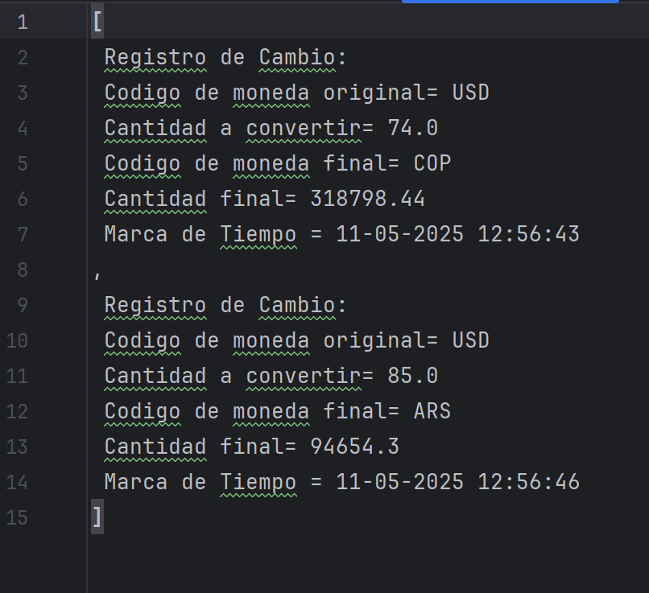
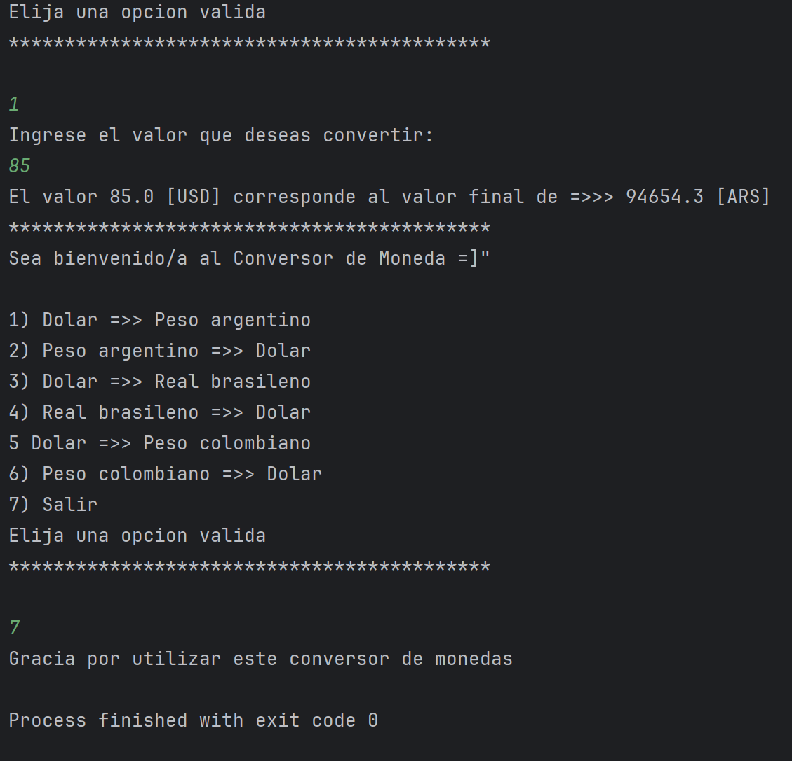

# Conversor de Monedas

## Descripción
Este proyecto es un conversor de monedas que permite a los usuarios convertir entre diferentes divisas utilizando datos de una API externa. 

## Tecnologías Utilizadas
- Java
- API de Exchange Rate
- IntelliJ IDEA

## Instalación
1. Clona este repositorio en tu máquina local.
2. Abre el proyecto en IntelliJ IDEA.
Asegúrate de tener Java instalado y configurado en tu entorno.
3. Asegurate de poner tu propia API KEY en la url.

## Uso

1. Ejecuta la aplicación.
2. Selecciona la opción de conversión deseada del menu de opciones.
3. Ingresa el valor que deseas convertir.
4. Obtén el resultado de la conversión.
5. Abre el archivo Registro.txt, aqui estara el registro de tus conversiones realizadas. 

## API
Este proyecto utiliza la API de Exchange Rate para obtener las tasas de cambio. 
Necesitarás una API Key para realizar las solicitudes. 
Puedes obtenerla registrándote en el sitio web de la API https://www.exchangerate-api.com/.Contribuciones

## Apoyo visual

        